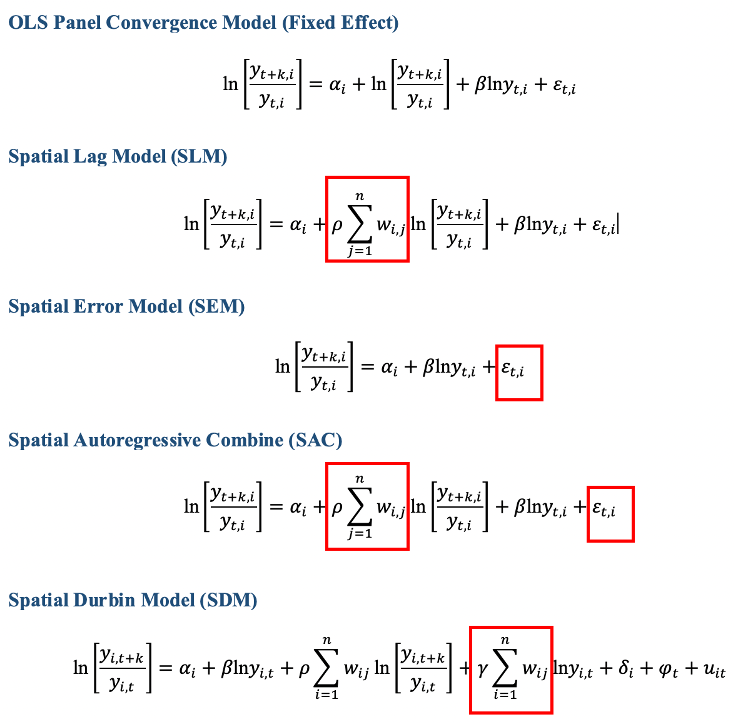

class: highlight-last-item
```{r setup, include=FALSE}
options(htmltools.dir.version = FALSE)
knitr::opts_chunk$set(echo = FALSE, warning = FALSE, message = FALSE)
library(tidyverse)
```

```{r xaringan-themer, include=FALSE, warning=FALSE}
library(xaringanthemer)
style_duo(
  primary_color = "#035AA6",        # blue = "#035AA6"
  secondary_color = "#161872",      # dark blue = "#161872" ; dark green =　"#00470e" ; orange = "#e87205"
  text_color = "#242629",
  link_color = "#00470e",   # orange = "#e87205"   dark green =　"#00470e"
  text_bold_color = "#035AA6",      # blue = "#035AA6"  dark green =　"#00470e"
  background_color = "#e1ebf4",
  inverse_background_color = "#e1ebf4",
  inverse_text_color = "#242629",
  title_slide_text_color = "#161872",   # dark blue = "#161872"
  title_slide_background_color = "#e1ebf4",
  header_font_google = google_font("Crete Round"),
  text_font_google   = google_font("Crete Round"),
  code_font_google   = google_font("Fira Mono"),
  header_h1_font_size = "2rem",
  header_h2_font_size = "1.20rem",
  header_h3_font_size = "1 rem",
  base_font_size = "20px"
)
```

```{css echo=FALSE}
.highlight-last-item > ul > li, 
.highlight-last-item > ol > li {
  opacity: 0.5;
}
.highlight-last-item > ul > li:last-of-type,
.highlight-last-item > ol > li:last-of-type {
  opacity: 1;
}
```

## Motivation:

-  A remarkable track of poverty alleviation and economic growth over past two decades at the national level (BPS-Statistics Indonesia)
--

- Poverty rate has attenuated from 40.10 percent to 15.40 percent during 1976-2009 (Teguh and
Nurkholis, 2011)
--

- The challenges to achieve SDG's Goal 1
--

- There is still scarcity on poverty studies in Indonesia employing new district-level dataset and evaluate spatial effects (geography matters) 
--

## Research Objective:

- Examine the existence of spatial clusters and find out the location of clusters 
- Examine the existence of poverty convergence across districts
- Evaluate the spatial effects on catching-up process in poverty reduction
- Investigate the determinants of regional poverty convergence across districts in Indonesia

---
class: highlight-last-item
  
## Methods:

- Spatial dependence analysis  (Anselin,1995;2007)
--

- Spatial econometric (Elhorst, 2003)
--


## Data:

- Three poverty indicators (Foster et.al.,1984;Sen,1976)
--

- Related determinants : economic structure, society structure, policy structure (Miranti,2005;2011)
--

- 514 districts over the 2010-2018 period 
--

---

class: middle, highlight-last-item

## Main Results:

1. **Spatial clusters exist** in both poverty indicators and the determinants. 
--

2. **Hot-spots in Eastern part of Indonesia** and **Cold-spots in Western part of Indonesia**
--

3. **Persistent East-West dichotomy** 
--

4. **Spatial effect significantly affects the catching-up process**

5. **Considerable differences in the speed of convergence among three poverty indicators**

5. **Mean years of schooling contributes the largest effect to the catching-up process in poverty reduction**


---

class: middle

# Outline of this presentation

1. Some stylized facts

  - Poverty rate across provinces
  - Poverty gap index across islands

2. Non-spatial and Spatial Convergence Framework

  - Global convergence test (intuition)
  - Spatial models and spatial convergence models

3. Main results of the paper

  - Hot-spots and cold-spots; persistent West-East dichotomy
  - Slight spatial (neighbourhood) effect
  - Spatial Durbin Model is the best specification model
  
<br />
<br />
[ Slides and paper available at: https://sea2021-poverty.netlify.app/ ]

---

class: center, middle

# (1) Some stylized facts

Poverty rate across 34 provinces

Poverty gap index across 8 main islands


---

class: middle,center

## Heterogeneous performance of poverty reduction across provinces, 2020


Note: Data obtained from BPS-Statistics Indonesia


---

class: middle,center

## Poverty differences across islands


Note: Author's calculation from data of BPS-Statistics Indonesia 
To explore other variables, please refer to this link created by author: https://chan912.shinyapps.io/explore-ExpandR-poverty/

---

class: middle,center

## Are there any signs of overall convergence?

 

Note : Y-axis reflects the value of global spatial autocorrelation (Moran's I) over the 2010-2018 period.
X-axis reflects the value of standard deviation over the 2010-2018 period

---

class: center, middle

# (2) Non-spatial and Spatial Convergence Framework

## Global Convergence Framework

 
---

class: center, middle

# Spatial Convergence Framework

## Some spatial models

 

Source: Golgher and Voss (2016)
---
class: middle, center

## Spatial convergence models

 

Source: Islam (1995) and Arbia (2003)
---
class: middle, center

# Weight Matrix

**In this study, the inverse distance matrix is preferred to
be applied**

---
class: middle, center

# (3) Main results

Global and Local Spatial Autocorrelation

Non-spatial and Spatial Poverty Convergence

Determinants of Poverty Convergence

---
class: middle, center

## Global Spatial Autocorrelation

 


---
class: middle, center

# Local indicators of Spatial Association

## LISA of Poverty Rate, 2010 and 2018

 

Note : LISA cluster maps refer to the classification proposed by Kondo (2015) 
---
class: middle, center

## LISA of Poverty Gap, 2010 and 2018

 

---
class: middle, center

## LISA of Poverty Severity, 2010 and 2018

 

---
class: middle, center

##Non-spatial and Spatial Panel Models (Maximum Likelihood Estimates) with Region (District) Fixed-Effect

---
class: middle, center

## Poverty Rate

 


---
class: middle, center

## Poverty Gap

 


---
class: middle, center

## Poverty Severity

 


---
class: highlight-last-item


# Concluding Remarks

- The presence of spatial dependence globally and locally across 514 districts in Indonesia
--

- Poverty convergence does exist in both non-spatial and spatial panel approach

- Role of neighbourhood (spatial effect) is significant in altering the speed of catching-up process in poverty reduction
--

- Educational variable and economic-related variables help to accelerate the catching-up process of poverty reduction in Indonesia.

--


## Implications and further research
--

- Recommended policy should incorporate inter-regional development strategies
--

- Developing well-constructed educational-based infrastructure and
economic hubs
--

- Combination of social protection-based policy and accessible infrastructure:
  - Next extension: (Re)evaluate the composition of convergence clubs using subnational data, which is to be constructed using satellite nightlight data.

- Next extension for further research
  - Re (evaluate) infrastructure and financial decentralization variables to observe the more comprehensive effects of policy variables.
  - The application of Geographically Weighted Regression (GWR) to evaluate the role of spatial heterogeneity.

---

class: left, middle

# References

**Anselin L (1995) Local indicators of spatial association—LISA. Geographical analysis 27(2):93–115**

**Anselin L, Sridharan S, Gholston S (2007) Using exploratory spatial data analysis to leverage social indicator databases: The discovery of interesting patterns. Social Indicators Research 82(2):287–309, DOI 10.1007/s11205-006-9034-x**

**Elhorst JP (2003) Specification and estimation of spatial panel data models. International Regional Science Review 26(3):244–268, DOI 10.1177/0160017603253791**

**Foster J, Greer J, Thorbecke E (1984) A Class of Decomposable Poverty Measures. Econometrica 52(3):761, DOI 10.2307/1913475**

**Golgher, André Braz, and Paul R. Voss. 2016. How to Interpret the Coefficients of Spatial Models: Spillovers, Direct and Indirect Effects. Vol. 4. 3. https://doi.org/10.1007/s40980-015-0016-y**

**Kondo, Keisuke. 2015. “Spatial persistence of Japanese unemployment rates.” Japan and the World Economy 36: 113–22. https://doi.org/10.1016/j.japwor.2015.11.001**

**Miranti.2011. “Regional patterns of poverty: Why do some provinces perform better than others?” Employment, Living Standards and Poverty in Contemporary Indonesia, no. December: 90–110. https://doi.org/10.1355/9789814345132-010**

**Sen A (1976) Poverty: An Ordinal Approach to Measurement. Econometrica 44(2):219, DOI 10.2307/1912718**

**Teguh D, Nurkholis N (2011) Finding out of the Determinants of Poverty Dynamics in Indonesia:Evidence from Panel Data (41185)**


---

class: center, middle

# Thank you very much for your attention


Slides and working paper available at: https://sea2021-poverty.netlify.app/

***


